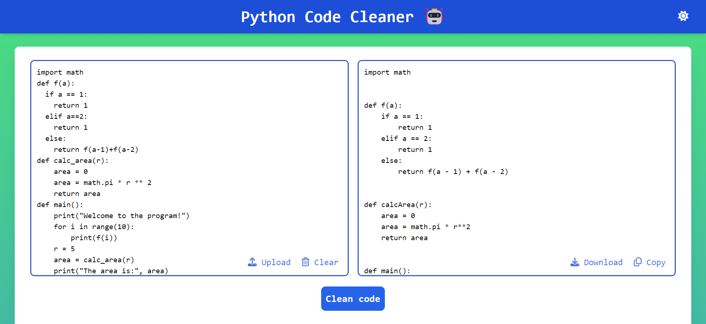

# Python Code Cleaner 🤖



## Overview

Python Code Cleaner is a web-based application that helps you clean and refactor messy Python code. This tool ensures that your code follows standard formatting practices, making it more readable and maintainable.

## Features

- **Clean and Refactor Code**: Automatically formats and refactors your Python code.
- **Dark Mode**: Switch between light and dark themes for a comfortable coding experience.
- **File Upload**: Upload your Python scripts directly and get them cleaned.
- **Copy and Download**: Easily copy the cleaned code to your clipboard or download it as a `.py` file.

## Installation

To run this project locally, follow these steps:

1. **Clone the Repository**:
   ```
   git clone https://github.com/Bhavesh-Mittal/Python-Code-Cleaner.git
   cd python-code-cleaner
   ```

2. **Install Dependencies**:
   ```
   pip install -r requirements.txt
   ```

3. **Start the Application**:
   ```
   python backend/app.py
   npm start
   ```